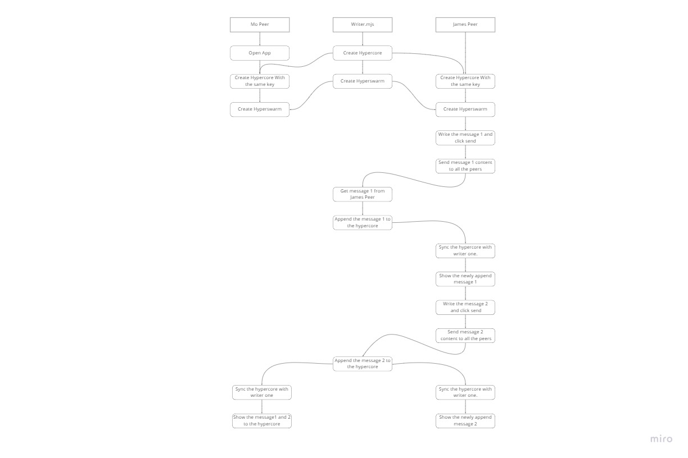

# About Project #
This is Chat app using Electron and Holepunch

# Server
Server is NodeJS app and is responsible for appending data to the hypercore.
Server is listening for peers on the hyperswarm and append message to hypercore as chat history
The server app is running.

# Client
Client is Electorn app to show ChatApp.
It creates the same hypercore with the one from the server.
And connects the same topic on the hyperswarm.
Once it runs, it replicates the hypercore with the server and show the chat history
Whenever user sends msg, it sends to hyperswarm to let server append it.

# Workflow
